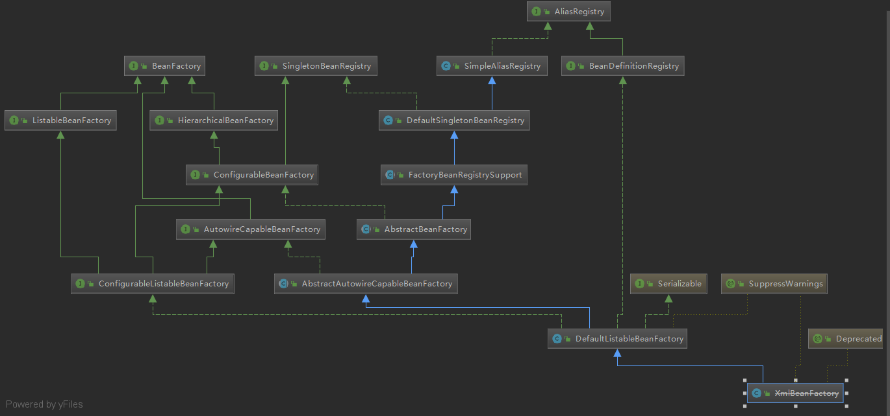
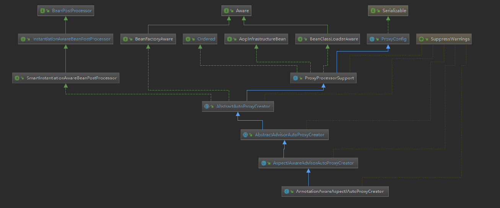

# Beans 学习
### 核心类
1. DefaultListableBeanFactory
是整个Bean加载的核心部分，Spring注册及加载Bean的默认实现，综合父类功能，主要是对bean注册后的处理

2. AliasRegistry:定义对Alias的简单增删改操作
3. SimpleAliasRegistry：主要使用map作为alias的缓存，并对接口AliasRegistry进行实现
4. SingletonBeanRegistry：定义对单例的注册及获取
5. BeanFactory：定义获取bean及bean的各种属性
6. DefaultSingletonBeanRegistry：对接口SingletonBeanRegistry各函数实现
7. HierarchicalBeanFactory：继承BeanFactory，增加对ParentFactory的支持
8. BeanDefinitionRegistry：定义对BeanDefinition的增删改操作
9. FactoryBeanRegistrySupport：在DefaultSingletonBeanRegistry增加对FactoryBean的特殊处理
10. ConfigurationBeanFactory：提供配置Factory的各种方法
11. ListableBeanFactory：根据各种条件获取bean的配置清单
12. AbstractBeanFactory：综合FactoryBeanRegistrySupport和ConfigurationBeanFactory的
13. AutowireCapableBeanFactory：提供创建Bean、自动注入、初始化以及应用后处理器
14. AbstractAutowireCapableBeanFactory：综合AbstractBeanFactory，并对AutowireCapableBeanFactory接口进行实现
15. ConfigurationListableBeanFactory：BeanFactory配置清单，指定忽略类型和接口等
16. XmlBeanFactory：对DefaultListableBeanFactory进行扩展，主要用于从XML文档读取BeanDefinition，主要变化在于定义XmlBeanDefinitionReader的reader属性
### XmlBeanFactory 
1. ResourceLoader：定义资源加载器，主要应用于根据给定的资源文件地址返回对应的Resource
    1.1 Java中将不同来源的资源抽象成URL，通过注册不同的handler（URLStreamHandler）来处理
    1.2 Spring使用Resource实现，如URLResource、ClassPathResource
2. BeanDefinitionReader：主要定义资源文件读取并转换为BeanDefinition
3. EnvironmentCapable：定义获取Environment的方法
4. DocumentLoader：定义从资源文件加载到转换为Document的方法
5. AbstractBeanDefinitionReader：对EnvironmentCapable、BeanDefinitionReader进行实现
6. BeanDefinitionDocumentReader：定义读取BeanDefinition并注册BeanDefinition的功能
7. BeanDefinitionParserDelegate：定义解析Element的方法


### getBean全流程（singleton模式）org.springframework.beans.factory.support.AbstractBeanFactory.doGetBean
```java
class  AbstractBeanFactory{
    protected <T> T doGetBean(
			String name, @Nullable Class<T> requiredType, @Nullable Object[] args, boolean typeCheckOnly)
			throws BeansException {
	    // 转换beanName，如别名
		String beanName = transformedBeanName(name);
		Object bean;

		// Eagerly check singleton cache for manually registered singletons.
		// 检查缓存或实例工厂是否有对应的实例
		// 因为创建单例bean的时候可能存在依赖注入，这里是为了避免循环依赖。提前将实例或factory暴露出来，可以直接引用
		Object sharedInstance = getSingleton(beanName);
		if (sharedInstance != null && args == null) {
			if (logger.isDebugEnabled()) {
				if (isSingletonCurrentlyInCreation(beanName)) {
					logger.debug("Returning eagerly cached instance of singleton bean '" + beanName +
							"' that is not fully initialized yet - a consequence of a circular reference");
				}
				else {
					logger.debug("Returning cached instance of singleton bean '" + beanName + "'");
				}
			}
			// sharedInstance可能是BeanFactory，
			bean = getObjectForBeanInstance(sharedInstance, name, beanName, null);
		}

		else {
			// Fail if we're already creating this bean instance:
			// We're assumably within a circular reference.
			if (isPrototypeCurrentlyInCreation(beanName)) {
				throw new BeanCurrentlyInCreationException(beanName);
			}

			// Check if bean definition exists in this factory.
			BeanFactory parentBeanFactory = getParentBeanFactory();
			// 如果当前BeanFactory不存在对应BeanDefinition，且存在父工厂
			if (parentBeanFactory != null && !containsBeanDefinition(beanName)) {
				// Not found -> check parent.
				// 但是，如果parent也没有，怎么处理的？不存在这种情况？
				String nameToLookup = originalBeanName(name);
				if (parentBeanFactory instanceof AbstractBeanFactory) {
					return ((AbstractBeanFactory) parentBeanFactory).doGetBean(
							nameToLookup, requiredType, args, typeCheckOnly);
				}
				else if (args != null) {
					// Delegation to parent with explicit args.
					return (T) parentBeanFactory.getBean(nameToLookup, args);
				}
				else {
					// No args -> delegate to standard getBean method.
					return parentBeanFactory.getBean(nameToLookup, requiredType);
				}
			}
			// 不仅仅是类型检查，标记Bean正在创建
			if (!typeCheckOnly) {
				markBeanAsCreated(beanName);
			}

			try {
				// 将BeanDefinition转换为RootBeanDefinition，如果是子Bean，合并父类的属性
				RootBeanDefinition mbd = getMergedLocalBeanDefinition(beanName);
				checkMergedBeanDefinition(mbd, beanName, args);

				// Guarantee initialization of beans that the current bean depends on.
				String[] dependsOn = mbd.getDependsOn();
				if (dependsOn != null) {
					// 遍历所有的依赖，递归实例化所有依赖的bean
					for (String dep : dependsOn) {
						if (isDependent(beanName, dep)) {
							throw new BeanCreationException(mbd.getResourceDescription(), beanName,
									"Circular depends-on relationship between '" + beanName + "' and '" + dep + "'");
						}
						registerDependentBean(dep, beanName);
						try {
							getBean(dep);
						} catch (NoSuchBeanDefinitionException ex) {
							throw new BeanCreationException(mbd.getResourceDescription(), beanName,
									"'" + beanName + "' depends on missing bean '" + dep + "'", ex);
						}
					}
				}

				// Create bean instance.
				if (mbd.isSingleton()) {
					// 真正创建单例
					sharedInstance = getSingleton(beanName, () -> {
						try {
							return createBean(beanName, mbd, args);
						} catch (BeansException ex) {
							// Explicitly remove instance from singleton cache: It might have been put there
							// eagerly by the creation process, to allow for circular reference resolution.
							// Also remove any beans that received a temporary reference to the bean.
							destroySingleton(beanName);
							throw ex;
						}
					});
					// 如果是Factory，要获取真正的实例对象返回
					bean = getObjectForBeanInstance(sharedInstance, name, beanName, mbd);
				} else if (mbd.isPrototype()) {
					// It's a prototype -> create a new instance.
					Object prototypeInstance = null;
					try {
						beforePrototypeCreation(beanName);
						prototypeInstance = createBean(beanName, mbd, args);
					}
					finally {
						afterPrototypeCreation(beanName);
					}
					bean = getObjectForBeanInstance(prototypeInstance, name, beanName, mbd);
				} else {
					String scopeName = mbd.getScope();
					if (!StringUtils.hasLength(scopeName)) {
						throw new IllegalStateException("No scope name defined for bean ´" + beanName + "'");
					}
					Scope scope = this.scopes.get(scopeName);
					if (scope == null) {
						throw new IllegalStateException("No Scope registered for scope name '" + scopeName + "'");
					}
					try {
						Object scopedInstance = scope.get(beanName, () -> {
							beforePrototypeCreation(beanName);
							try {
								return createBean(beanName, mbd, args);
							}
							finally {
								afterPrototypeCreation(beanName);
							}
						});
						bean = getObjectForBeanInstance(scopedInstance, name, beanName, mbd);
					} catch (IllegalStateException ex) {
						throw new BeanCreationException(beanName,
								"Scope '" + scopeName + "' is not active for the current thread; consider " +
								"defining a scoped proxy for this bean if you intend to refer to it from a singleton",
								ex);
					}
				}
			} catch (BeansException ex) {
				cleanupAfterBeanCreationFailure(beanName);
				throw ex;
			}
		}

		// Check if required type matches the type of the actual bean instance.
		if (requiredType != null && !requiredType.isInstance(bean)) {
			try {
				T convertedBean = getTypeConverter().convertIfNecessary(bean, requiredType);
				if (convertedBean == null) {
					throw new BeanNotOfRequiredTypeException(name, requiredType, bean.getClass());
				}
				return convertedBean;
			}
			catch (TypeMismatchException ex) {
				if (logger.isDebugEnabled()) {
					logger.debug("Failed to convert bean '" + name + "' to required type '" +
							ClassUtils.getQualifiedName(requiredType) + "'", ex);
				}
				throw new BeanNotOfRequiredTypeException(name, requiredType, bean.getClass());
			}
		}
		return (T) bean;
	}
}
```
1. 解析beanName，因为传入的参数可能是别名，也可能是BeanFactory
2. 尝试获取单例 org.springframework.beans.factory.support.DefaultSingletonBeanRegistry.getSingleton(java.lang.String, boolean)
```java
public class DefaultSingletonBeanRegistry{
protected Object getSingleton(String beanName, boolean allowEarlyReference) {
	// 首先尝试从实例化完成的map中获取对象
		Object singletonObject = this.singletonObjects.get(beanName);
		// 如果为空，且单例正在构建
		if (singletonObject == null && isSingletonCurrentlyInCreation(beanName)) {
			synchronized (this.singletonObjects) {
				// 从提前曝光的单例map中获取
				singletonObject = this.earlySingletonObjects.get(beanName);
				if (singletonObject == null && allowEarlyReference) {
					// 如果还没有提前曝光，且允许提前曝光，就会尝试获取BeanFactory
					ObjectFactory<?> singletonFactory = this.singletonFactories.get(beanName);
					if (singletonFactory != null) {
						// 返回BeanFactory
						singletonObject = singletonFactory.getObject();
						this.earlySingletonObjects.put(beanName, singletonObject);
						this.singletonFactories.remove(beanName);
					}
					// 问题，如果不允许提前曝光，BeanFactory可能会重复创建吗？map去重？
				}
			}
		}
		return singletonObject;
	}
}
```
3. Bean实例化 org.springframework.beans.factory.support.AbstractBeanFactory.getObjectForBeanInstance
```java
class DefaultSingletonBeanRegistry extends SimpleAliasRegistry implements SingletonBeanRegistry{
public Object getSingleton(String beanName, ObjectFactory<?> singletonFactory) {
		Assert.notNull(beanName, "Bean name must not be null");
		// 锁住整个map
		synchronized (this.singletonObjects) {
			Object singletonObject = this.singletonObjects.get(beanName);
			if (singletonObject == null) {
				// 如果为空，且正在创建中
				if (this.singletonsCurrentlyInDestruction) {
					throw new BeanCreationNotAllowedException(beanName,
							"Singleton bean creation not allowed while singletons of this factory are in destruction " +
							"(Do not request a bean from a BeanFactory in a destroy method implementation!)");
				}
				if (logger.isDebugEnabled()) {
					logger.debug("Creating shared instance of singleton bean '" + beanName + "'");
				}
				// 前置处理，默认实现是记录加载状态
				beforeSingletonCreation(beanName);
				boolean newSingleton = false;
				boolean recordSuppressedExceptions = (this.suppressedExceptions == null);
				if (recordSuppressedExceptions) {
					this.suppressedExceptions = new LinkedHashSet<>();
				}
				try {
					// 初始化Bean
					singletonObject = singletonFactory.getObject();
					newSingleton = true;
				} catch (IllegalStateException ex) {
					// Has the singleton object implicitly appeared in the meantime ->
					// if yes, proceed with it since the exception indicates that state.
					singletonObject = this.singletonObjects.get(beanName);
					if (singletonObject == null) {
						throw ex;
					}
				} catch (BeanCreationException ex) {
					if (recordSuppressedExceptions) {
						for (Exception suppressedException : this.suppressedExceptions) {
							ex.addRelatedCause(suppressedException);
						}
					}
					throw ex;
				}
				finally {
					if (recordSuppressedExceptions) {
						this.suppressedExceptions = null;
					}
					// 后置处理，默认实现是移除加载状态
					afterSingletonCreation(beanName);
				}
				if (newSingleton) {
					// 如果是新的单例，加入到map（4级）
					addSingleton(beanName, singletonObject);
				}
			}
			return singletonObject;
		}
	}	
}
class  AbstractBeanFactory  extends FactoryBeanRegistrySupport implements ConfigurableBeanFactory{
protected Object getObjectForBeanInstance(
			Object beanInstance, String name, String beanName, @Nullable RootBeanDefinition mbd) {

		// Don't let calling code try to dereference the factory if the bean isn't a factory.
		// FactoryBean的bean名称已&开头
		if (BeanFactoryUtils.isFactoryDereference(name)) {
			if (beanInstance instanceof NullBean) {
				return beanInstance;
			}
			if (!(beanInstance instanceof FactoryBean)) {
				throw new BeanIsNotAFactoryException(beanName, beanInstance.getClass());
			}
		}

		// Now we have the bean instance, which may be a normal bean or a FactoryBean.
		// If it's a FactoryBean, we use it to create a bean instance, unless the
		// caller actually wants a reference to the factory.
		if (!(beanInstance instanceof FactoryBean) || BeanFactoryUtils.isFactoryDereference(name)) {
		    // 如果不是FactoryBean，是实例，直接返回
		    // 如果是FactoryBean，且调用者需要返回的正式FactoryBean，才返回
			return beanInstance;
		}
        // 利用FactoryBean真正创建实例
		Object object = null;
		if (mbd == null) {
			// 尝试从缓存加载对象
			object = getCachedObjectForFactoryBean(beanName);
		}
		if (object == null) {
			// Return bean instance from factory.
			// 缓存中无该对象，创建对象
			FactoryBean<?> factory = (FactoryBean<?>) beanInstance;
			// Caches object obtained from FactoryBean if it is a singleton.
			// 如果BeanDefinition参数是空，但实际上注册过
			if (mbd == null && containsBeanDefinition(beanName)) {
				mbd = getMergedLocalBeanDefinition(beanName);
			}
			// synthetic为true，表示是应用程序本身定义的，而非用户定义
			boolean synthetic = (mbd != null && mbd.isSynthetic());
			object = getObjectFromFactoryBean(factory, beanName, !synthetic);
		}
		return object;
	}
	
	

}

class FactoryBeanRegistrySupport {
	protected Object getObjectFromFactoryBean(FactoryBean<?> factory, String beanName, boolean shouldPostProcess) {
        		if (factory.isSingleton() && containsSingleton(beanName)) {
        			synchronized (getSingletonMutex()) {
        				// 如果是单例，加锁，再尝试从缓存获取
        				Object object = this.factoryBeanObjectCache.get(beanName);
        				if (object == null) {
        					object = doGetObjectFromFactoryBean(factory, beanName);
        					// Only post-process and store if not put there already during getObject() call above
        					// (e.g. because of circular reference processing triggered by custom getBean calls)
        					Object alreadyThere = this.factoryBeanObjectCache.get(beanName);
        					if (alreadyThere != null) {
        						object = alreadyThere;
        					} else {
        						// 需要后置处理（只有调用了getObject()方法才需要后置处理）
        						if (shouldPostProcess) {
        							if (isSingletonCurrentlyInCreation(beanName)) {
        								// Temporarily return non-post-processed object, not storing it yet..
        								return object;
        							}
        							beforeSingletonCreation(beanName);
        							try {
        								// AbstractBeanFactory内什么也没做，子类AbstractAutowireCapableBeanFactory有默认实现
        								object = postProcessObjectFromFactoryBean(object, beanName);
        							}
        							catch (Throwable ex) {
        								throw new BeanCreationException(beanName,
        										"Post-processing of FactoryBean's singleton object failed", ex);
        							}
        							finally {
        								afterSingletonCreation(beanName);
        							}
        						}
        						if (containsSingleton(beanName)) {
        							this.factoryBeanObjectCache.put(beanName, object);
        						}
        					}
        				}
        				return object;
        			}
        		} else {
        			Object object = doGetObjectFromFactoryBean(factory, beanName);
        			if (shouldPostProcess) {
        				try {
        					object = postProcessObjectFromFactoryBean(object, beanName);
        				}
        				catch (Throwable ex) {
        					throw new BeanCreationException(beanName, "Post-processing of FactoryBean's object failed", ex);
        				}
        			}
        			return object;
        		}
        	}
        	
        	
        	private Object doGetObjectFromFactoryBean(FactoryBean<?> factory, String beanName) throws BeanCreationException {
            		Object object;
            		try {
            			// 需要权限验证
            			if (System.getSecurityManager() != null) {
            				AccessControlContext acc = getAccessControlContext();
            				try {
            					object = AccessController.doPrivileged((PrivilegedExceptionAction<Object>) factory::getObject, acc);
            				} catch (PrivilegedActionException pae) {
            					throw pae.getException();
            				}
            			}
            			else {
            				// 获取bean
            				object = factory.getObject();
            			}
            		} catch (FactoryBeanNotInitializedException ex) {
            			throw new BeanCurrentlyInCreationException(beanName, ex.toString());
            		} catch (Throwable ex) {
            			throw new BeanCreationException(beanName, "FactoryBean threw exception on object creation", ex);
            		}
            
            		// Do not accept a null value for a FactoryBean that's not fully
            		// initialized yet: Many FactoryBeans just return null then.
            		if (object == null) {
            			// bean正在创建，外层不是加锁了吗？
            			if (isSingletonCurrentlyInCreation(beanName)) {
            				throw new BeanCurrentlyInCreationException(
            						beanName, "FactoryBean which is currently in creation returned null from getObject");
            			}
            			object = new NullBean();
            		}
            		return object;
            	}
}

class AbstractAutowireCapableBeanFactory{
	protected Object postProcessObjectFromFactoryBean(Object object, String beanName) {
    		return applyBeanPostProcessorsAfterInitialization(object, beanName);
	}
    		@Override
        	public Object applyBeanPostProcessorsAfterInitialization(Object existingBean, String beanName)
        			throws BeansException {
        
        		Object result = existingBean;
        		// 调用后置处理器的postProcessAfterInitialization方法
        		for (BeanPostProcessor processor : getBeanPostProcessors()) {
        			Object current = processor.postProcessAfterInitialization(result, beanName);
        			if (current == null) {
        				return result;
        			}
        			result = current;
        		}
        		return result;
        	}
        	
    @Override
 	protected Object createBean(String beanName, RootBeanDefinition mbd, @Nullable Object[] args)
 			throws BeanCreationException {
 
 		if (logger.isDebugEnabled()) {
 			logger.debug("Creating instance of bean '" + beanName + "'");
 		}
 		RootBeanDefinition mbdToUse = mbd;
 
 		// Make sure bean class is actually resolved at this point, and
 		// clone the bean definition in case of a dynamically resolved Class
 		// which cannot be stored in the shared merged bean definition.
 		Class<?> resolvedClass = resolveBeanClass(mbd, beanName);
 		if (resolvedClass != null && !mbd.hasBeanClass() && mbd.getBeanClassName() != null) {
 			mbdToUse = new RootBeanDefinition(mbd);
 			mbdToUse.setBeanClass(resolvedClass);
 		}
 
 		// Prepare method overrides.验证及准备要复写的方法，准备过程在AbstractBeanDefinition类
 		try {
 			mbdToUse.prepareMethodOverrides();
 		} catch (BeanDefinitionValidationException ex) {
 			throw new BeanDefinitionStoreException(mbdToUse.getResourceDescription(),
 					beanName, "Validation of method overrides failed", ex);
 		}
 
 		try {
 			// Give BeanPostProcessors a chance to return a proxy instead of the target bean instance.
 			// 给BeanPostProcessors一个机会返回一个代理类，替代真正的实例。这一行代码的关键作用在于是否做AOP增强
 			// 注意，如果在这里生成了Bean，直接返回，不进行doCreateBean过程
 			Object bean = resolveBeforeInstantiation(beanName, mbdToUse);
 			if (bean != null) {
 				return bean;
 			}
 		} catch (Throwable ex) {
 			throw new BeanCreationException(mbdToUse.getResourceDescription(), beanName,
 					"BeanPostProcessor before instantiation of bean failed", ex);
 		}
 
 		try {
 			// 真正创建实例
 			Object beanInstance = doCreateBean(beanName, mbdToUse, args);
 			if (logger.isDebugEnabled()) {
 				logger.debug("Finished creating instance of bean '" + beanName + "'");
 			}
 			return beanInstance;
 		} catch (BeanCreationException | ImplicitlyAppearedSingletonException ex) {
 			// A previously detected exception with proper bean creation context already,
 			// or illegal singleton state to be communicated up to DefaultSingletonBeanRegistry.
 			throw ex;
 		} catch (Throwable ex) {
 			throw new BeanCreationException(
 					mbdToUse.getResourceDescription(), beanName, "Unexpected exception during bean creation", ex);
 		}
 	}
 
 	@Nullable
 	protected Object resolveBeforeInstantiation(String beanName, RootBeanDefinition mbd) {
 		Object bean = null;
 		// 如果没有被解析
 		if (!Boolean.FALSE.equals(mbd.beforeInstantiationResolved)) {
 			// Make sure bean class is actually resolved at this point.
 			if (!mbd.isSynthetic() && hasInstantiationAwareBeanPostProcessors()) {
 				Class<?> targetType = determineTargetType(beanName, mbd);
 				if (targetType != null) {
 					// 后置处理
 					bean = applyBeanPostProcessorsBeforeInstantiation(targetType, beanName);
 					if (bean != null) {
 						bean = applyBeanPostProcessorsAfterInitialization(bean, beanName);
 					}
 				}
 			}
 			mbd.beforeInstantiationResolved = (bean != null);
 		}
 		return bean;
 	}
 	
    @Nullable
 	protected Object applyBeanPostProcessorsBeforeInstantiation(Class<?> beanClass, String beanName) {
 		for (BeanPostProcessor bp : getBeanPostProcessors()) {
 			if (bp instanceof InstantiationAwareBeanPostProcessor) {
 				InstantiationAwareBeanPostProcessor ibp = (InstantiationAwareBeanPostProcessor) bp;
 				Object result = ibp.postProcessBeforeInstantiation(beanClass, beanName);
 				if (result != null) {
 					return result;
 				}
 			}
 		}
 		return null;
 	}
 	
    @Override
 	public Object applyBeanPostProcessorsAfterInitialization(Object existingBean, String beanName)
 			throws BeansException {
 
 		Object result = existingBean;
 		for (BeanPostProcessor processor : getBeanPostProcessors()) {
 			Object current = processor.postProcessAfterInitialization(result, beanName);
 			if (current == null) {
 				return result;
 			}
 			result = current;
 		}
 		return result;
 	}
 	
    protected Object doCreateBean(String beanName, RootBeanDefinition mbd, @Nullable Object[] args)
 			throws BeanCreationException {
 
 		// Instantiate the bean.
 		BeanWrapper instanceWrapper = null;
 		if (mbd.isSingleton()) {
 			// 从缓存获取
 			instanceWrapper = this.factoryBeanInstanceCache.remove(beanName);
 		}
 		if (instanceWrapper == null) {
 			// 缓存获取为空，创建实例
 			instanceWrapper = createBeanInstance(beanName, mbd, args);
 		}
 		Object bean = instanceWrapper.getWrappedInstance();
 		Class<?> beanType = instanceWrapper.getWrappedClass();
 		if (beanType != NullBean.class) {
 			mbd.resolvedTargetType = beanType;
 		}
 
 		// Allow post-processors to modify the merged bean definition.
 		synchronized (mbd.postProcessingLock) {
 			if (!mbd.postProcessed) {
 				try {
 					// 应用MergedBeanDefinitionPostProcessors
 					applyMergedBeanDefinitionPostProcessors(mbd, beanType, beanName);
 				}
 				catch (Throwable ex) {
 					throw new BeanCreationException(mbd.getResourceDescription(), beanName,
 							"Post-processing of merged bean definition failed", ex);
 				}
 				mbd.postProcessed = true;
 			}
 		}
 
 		// Eagerly cache singletons to be able to resolve circular references
 		// even when triggered by lifecycle interfaces like BeanFactoryAware.
 		// 是否允许提早曝光：单例&&允许循环依赖&&当前bean正在创建中
 		boolean earlySingletonExposure = (mbd.isSingleton() && this.allowCircularReferences &&
 				isSingletonCurrentlyInCreation(beanName));
 		if (earlySingletonExposure) {
 			if (logger.isDebugEnabled()) {
 				logger.debug("Eagerly caching bean '" + beanName +
 						"' to allow for resolving potential circular references");
 			}
 			// 为避免后期循环依赖，初始化完成前将ObjectFactory加入工厂
 			addSingletonFactory(beanName, () -> getEarlyBeanReference(beanName, mbd, bean));
 			/**
 			* 应用SmartInstantiationAwareBeanPostProcessor
 			* protected Object getEarlyBeanReference(String beanName, RootBeanDefinition mbd, Object bean) {
            * 		Object exposedObject = bean;
            *  		if (!mbd.isSynthetic() && hasInstantiationAwareBeanPostProcessors()) {
            * 			for (BeanPostProcessor bp : getBeanPostProcessors()) {
            *  				if (bp instanceof SmartInstantiationAwareBeanPostProcessor) {
            * 					SmartInstantiationAwareBeanPostProcessor ibp = (SmartInstantiationAwareBeanPostProcessor) bp;
            * 					exposedObject = ibp.getEarlyBeanReference(exposedObject, beanName);
            * 				}
            * 			}
            * 		}
            *  		return exposedObject;
            *  	}
            */
 		}
 
 		// Initialize the bean instance.
 		Object exposedObject = bean;
 		try {
 			// 初始化Bean，并对属性填充；可能会递归初始化依赖Bean
 			populateBean(beanName, mbd, instanceWrapper);
 			// 调用初始化方法，如init-method
 			exposedObject = initializeBean(beanName, exposedObject, mbd);
 		}
 		catch (Throwable ex) {
 			if (ex instanceof BeanCreationException && beanName.equals(((BeanCreationException) ex).getBeanName())) {
 				throw (BeanCreationException) ex;
 			}
 			else {
 				throw new BeanCreationException(
 						mbd.getResourceDescription(), beanName, "Initialization of bean failed", ex);
 			}
 		}
 
 		if (earlySingletonExposure) {
 			Object earlySingletonReference = getSingleton(beanName, false);
 			// earlySingletonReference 仅在检测出循环依赖时不为空
 			if (earlySingletonReference != null) {
 				if (exposedObject == bean) {
 					// exposedObject在初始方法没有被改变，也就是没有增强
 					exposedObject = earlySingletonReference;
 				} else if (!this.allowRawInjectionDespiteWrapping && hasDependentBean(beanName)) {
 					String[] dependentBeans = getDependentBeans(beanName);
 					Set<String> actualDependentBeans = new LinkedHashSet<>(dependentBeans.length);
 					for (String dependentBean : dependentBeans) {
 						// 检测依赖
 						if (!removeSingletonIfCreatedForTypeCheckOnly(dependentBean)) {
 							actualDependentBeans.add(dependentBean);
 						}
 					}
 					// 
 					if (!actualDependentBeans.isEmpty()) {
 						throw new BeanCurrentlyInCreationException(beanName,
 								"Bean with name '" + beanName + "' has been injected into other beans [" +
 								StringUtils.collectionToCommaDelimitedString(actualDependentBeans) +
 								"] in its raw version as part of a circular reference, but has eventually been " +
 								"wrapped. This means that said other beans do not use the final version of the " +
 								"bean. This is often the result of over-eager type matching - consider using " +
 								"'getBeanNamesForType' with the 'allowEagerInit' flag turned off, for example.");
 					}
 				}
 			}
 		}
 
 		// Register bean as disposable.
 		try {
 			// 根据score注册bean，如果配置了destory-method，这里需要注册以便于在销毁的时候调用
 			registerDisposableBeanIfNecessary(beanName, bean, mbd);
 		}
 		catch (BeanDefinitionValidationException ex) {
 			throw new BeanCreationException(
 					mbd.getResourceDescription(), beanName, "Invalid destruction signature", ex);
 		}
 
 		return exposedObject;
 	}

}

class AbstractBeanDefinition  extends BeanMetadataAttributeAccessor
      		implements BeanDefinition, Cloneable {
	
		public void prepareMethodOverrides() throws BeanDefinitionValidationException {
    		// Check that lookup methods exist and determine their overloaded status.
    		if (hasMethodOverrides()) {
    			getMethodOverrides().getOverrides().forEach(this::prepareMethodOverride);
    		}
    	}

	protected void prepareMethodOverride(MethodOverride mo) throws BeanDefinitionValidationException {
	        // 方法前置处理，根据Bean名称和MethodName获取对应的方法
    		int count = ClassUtils.getMethodCountForName(getBeanClass(), mo.getMethodName());
    		if (count == 0) {
    			throw new BeanDefinitionValidationException(
    					"Invalid method override: no method with name '" + mo.getMethodName() +
    					"' on class [" + getBeanClassName() + "]");
    		}
    		else if (count == 1) {
    			// Mark override as not overloaded, to avoid the overhead of arg type checking.
    			// 标记override，避免参数类型检查
    			mo.setOverloaded(false);
    		}
    		// 如果有多个重载方法，这里不做处理
    	}
}
```
### FactoryBean 
1. 工厂接口，当class是此接口的子类时，getBean()获取的不是FactoryBean本身，而是getObject()返回的对象

### 循环依赖
1. 构造器循环依赖，无法解决
2. Setter循环依赖，可通过Spring容器提前暴露刚完成构造器但未完成其他步骤的bean来完成，只能解决单例模式下的循环依赖
3. prototype循环依赖，无法解决

### 容器扩展功能
1. BeanFactory和ApplicationContext都是用于加载bean，但后者提供了更多的扩展功能，除非在一些限制场合如字节长度对内容有很大影响时，通常选用后者
2. ApplicationContext加载过程
```java
class XmlApplicationContextTest{
    @Test
    public void initContext(){
	    ApplicationContext ac = new ClassPathXmlApplicationContext();
    }
}

class ClassPathXmlApplicationContext {
	public ClassPathXmlApplicationContext(
    			String[] configLocations, boolean refresh, @Nullable ApplicationContext parent)
    			throws BeansException {
    
    		super(parent);
    		setConfigLocations(configLocations);
    		if (refresh) {
    			refresh();
    		}
    	}
}
public abstract class AbstractApplicationContext extends DefaultResourceLoader
		implements ConfigurableApplicationContext 
	@Override
    public void refresh() throws BeansException, IllegalStateException {
		synchronized (this.startupShutdownMonitor) {
			// Prepare this context for refreshing. 准备刷新上下文
			prepareRefresh();

			// Tell the subclass to refresh the internal bean factory. 初始化BeanFactory，并对XML文件进行读取
			ConfigurableListableBeanFactory beanFactory = obtainFreshBeanFactory();

			// Prepare the bean factory for use in this context. 对BeanFactory进行各种功能填充
			prepareBeanFactory(beanFactory);

			try {
				// Allows post-processing of the bean factory in context subclasses. 让子类方法进行额外处理
				postProcessBeanFactory(beanFactory);

				// Invoke factory processors registered as beans in the context. 激活各种BeanFactory处理器
				invokeBeanFactoryPostProcessors(beanFactory);

				// Register bean processors that intercept bean creation. 注册Bean处理器，实际上在getBean才会执行
				registerBeanPostProcessors(beanFactory);

				// Initialize message source for this context. 为上下文初始化Message源，即国际化处理
				initMessageSource();

				// Initialize event multicaster for this context. 初始化事件广播器
				initApplicationEventMulticaster();

				// Initialize other special beans in specific context subclasses. 留给子类来初始化其他Bean
				onRefresh();

				// Check for listener beans and register them. 查找并注册Listener到事件广播器
				registerListeners();

				// Instantiate all remaining (non-lazy-init) singletons. 初始化剩下的单例（非懒加载）
				finishBeanFactoryInitialization(beanFactory);

				// Last step: publish corresponding event. 发布完成刷新事件
				finishRefresh();
			}

			catch (BeansException ex) {
				if (logger.isWarnEnabled()) {
					logger.warn("Exception encountered during context initialization - " +
							"cancelling refresh attempt: " + ex);
				}

				// Destroy already created singletons to avoid dangling resources.
				destroyBeans();

				// Reset 'active' flag.
				cancelRefresh(ex);

				// Propagate exception to caller.
				throw ex;
			}

			finally {
				// Reset common introspection caches in Spring's core, since we
				// might not ever need metadata for singleton beans anymore...
				resetCommonCaches();
			}
		}
	}
	
	protected void prepareRefresh() {
    		// Switch to active.
    		this.startupDate = System.currentTimeMillis();
    		this.closed.set(false);
    		this.active.set(true);
    
    		if (logger.isInfoEnabled()) {
    			logger.info("Refreshing " + this);
    		}
    
    		// Initialize any placeholder property sources in the context environment. 留给子类覆盖
    		initPropertySources();
    
    		// Validate that all properties marked as required are resolvable:
    		// see ConfigurablePropertyResolver#setRequiredProperties
    		// 属性校验，可以自定义
    		getEnvironment().validateRequiredProperties();
    
    		// Store pre-refresh ApplicationListeners...
    		if (this.earlyApplicationListeners == null) {
    			this.earlyApplicationListeners = new LinkedHashSet<>(this.applicationListeners);
    		}
    		else {
    			// Reset local application listeners to pre-refresh state.
    			this.applicationListeners.clear();
    			this.applicationListeners.addAll(this.earlyApplicationListeners);
    		}
    
    		// Allow for the collection of early ApplicationEvents,
    		// to be published once the multicaster is available...
    		this.earlyApplicationEvents = new LinkedHashSet<>();
    	}
    
    
    protected ConfigurableListableBeanFactory obtainFreshBeanFactory() {
    		refreshBeanFactory();
    		ConfigurableListableBeanFactory beanFactory = getBeanFactory();
    		if (logger.isDebugEnabled()) {
    			logger.debug("Bean factory for " + getDisplayName() + ": " + beanFactory);
    		}
    		return beanFactory;
    }
    
    
    protected final void refreshBeanFactory() throws BeansException {
    		if (hasBeanFactory()) {
    			// 如果已经存在，销毁并关闭
    			destroyBeans();
    			closeBeanFactory();
    		}
    		try {
    			// 创建BeanFactory
    			DefaultListableBeanFactory beanFactory = createBeanFactory();
    			// 指定序列化id
    			beanFactory.setSerializationId(getId());
    			// 定制beanFactory
    			customizeBeanFactory(beanFactory);
    			/**
    			* 设置是否允许重写，是否允许循环依赖
    			* protected void customizeBeanFactory(DefaultListableBeanFactory beanFactory) {
                *  		if (this.allowBeanDefinitionOverriding != null) {
                *  			beanFactory.setAllowBeanDefinitionOverriding(this.allowBeanDefinitionOverriding);
                *  		}
                *  		if (this.allowCircularReferences != null) {
                *  			beanFactory.setAllowCircularReferences(this.allowCircularReferences);
                *  		}
                *  	// 书上代码没有，设置@Autowired和@Qualifier注解解析器
                *  	// beanFactory.setAutowiredCandidateResolver(new QulifierAnnotationAutowireCandidateResolver())
                *  	}
                */
    			// 原先的加载流程（初始化DocumentReader，并对xml进行读取解析）
    			loadBeanDefinitions(beanFactory);
    			this.beanFactory = beanFactory;
    		}
    		catch (IOException ex) {
    			throw new ApplicationContextException("I/O error parsing bean definition source for " + getDisplayName(), ex);
    		}
    }
}

```

### AOP实现
1. AopNamespaceHandler
```java
public class AopNamespaceHandler extends NamespaceHandlerSupport {

	/**
	 * Register the {@link BeanDefinitionParser BeanDefinitionParsers} for the
	 * '{@code config}', '{@code spring-configured}', '{@code aspectj-autoproxy}'
	 * and '{@code scoped-proxy}' tags.
	 */
	@Override
	public void init() {
		// In 2.0 XSD as well as in 2.5+ XSDs
		registerBeanDefinitionParser("config", new ConfigBeanDefinitionParser());
		registerBeanDefinitionParser("aspectj-autoproxy", new AspectJAutoProxyBeanDefinitionParser());
		/**
		* AspectJAutoProxyBeanDefinitionParser.parse()
		* public BeanDefinition parse(Element element, ParserContext parserContext) {
        *  		AopNamespaceUtils.registerAspectJAnnotationAutoProxyCreatorIfNecessary(parserContext, element);
        *  		extendBeanDefinition(element, parserContext);
        *  		return null;
        *  	}
        */
		registerBeanDefinitionDecorator("scoped-proxy", new ScopedProxyBeanDefinitionDecorator());

		// Only in 2.0 XSD: moved to context namespace in 2.5+
		registerBeanDefinitionParser("spring-configured", new SpringConfiguredBeanDefinitionParser());
	}

}
```
2. AnnotationAwareAspectJAutoProxyCreator

```java
// AnnotationAwareAspectJAutoProxyCreator 继承自BeanPostProcessor
public abstract class AbstractAutoProxyCreator extends ProxyProcessorSupport
		implements SmartInstantiationAwareBeanPostProcessor, BeanFactoryAware {
	    @Override
    	public Object postProcessBeforeInstantiation(Class<?> beanClass, String beanName) throws BeansException {
    		// 根据指定的bean的class和name构建一个key
    		Object cacheKey = getCacheKey(beanClass, beanName);
    
    		if (!StringUtils.hasLength(beanName) || !this.targetSourcedBeans.contains(beanName)) {
    			if (this.advisedBeans.containsKey(cacheKey)) {
    				// 如果已经处理过
    				return null;
    			}
    			if (isInfrastructureClass(beanClass) || shouldSkip(beanClass, beanName)) {
    				this.advisedBeans.put(cacheKey, Boolean.FALSE);
    				// 给定的类是否代表一个基础设施类，基础设施类不应代理，或者配置了指定bean，不需要自动代理
    				return null;
    			}
    		}
    
    		// Create proxy here if we have a custom TargetSource.
    		// Suppresses unnecessary default instantiation of the target bean:
    		// The TargetSource will handle target instances in a custom fashion.
    		TargetSource targetSource = getCustomTargetSource(beanClass, beanName);
    		if (targetSource != null) {
    			if (StringUtils.hasLength(beanName)) {
    				this.targetSourcedBeans.add(beanName);
    			}
    			// 获取增强方法或增强器
    			Object[] specificInterceptors = getAdvicesAndAdvisorsForBean(beanClass, beanName, targetSource);
    			// 创建代理bean
    			Object proxy = createProxy(beanClass, beanName, specificInterceptors, targetSource);
    			this.proxyTypes.put(cacheKey, proxy.getClass());
    			return proxy;
    		}
    
    		return null;
    	}
    
    	@Override
    	public boolean postProcessAfterInstantiation(Object bean, String beanName) {
    		return true;
    	}
    	
 	protected Object createProxy(Class<?> beanClass, @Nullable String beanName,
 			@Nullable Object[] specificInterceptors, TargetSource targetSource) {
 
 		if (this.beanFactory instanceof ConfigurableListableBeanFactory) {
 			AutoProxyUtils.exposeTargetClass((ConfigurableListableBeanFactory) this.beanFactory, beanName, beanClass);
 		}
 
 		// 新建ProxyFactory，复制属性
 		ProxyFactory proxyFactory = new ProxyFactory();
 		proxyFactory.copyFrom(this);
 
 		// isProxyTargetClass()返回是否直接代理目标类以及任何接口。
 		if (!proxyFactory.isProxyTargetClass()) {
 			// 是否应该代理目标类，而不是接口
 			if (shouldProxyTargetClass(beanClass, beanName)) {
 				proxyFactory.setProxyTargetClass(true);
 			} else {
 				// 检查那些接口应该被代理
 				evaluateProxyInterfaces(beanClass, proxyFactory);
 				/**
 				 * 检查给定bean类上的接口，并将它们应用于ProxyFactory（如果适用）。
 				 * protected void evaluateProxyInterfaces(Class<?> beanClass, ProxyFactory proxyFactory) {
 				 * 		Class<?>[] targetInterfaces = ClassUtils.getAllInterfacesForClass(beanClass, getProxyClassLoader());
 				 * 		boolean hasReasonableProxyInterface = false;
 				 * 		for (Class<?> ifc : targetInterfaces) {
 				 *
 				 * 		// protected boolean isConfigurationCallbackInterface(Class<?> ifc) {
 				 * 		//		return (InitializingBean.class == ifc || DisposableBean.class == ifc || Closeable.class == ifc ||
 				 * 		//		AutoCloseable.class == ifc || ObjectUtils.containsElement(ifc.getInterfaces(), Aware.class));
 				 *      // }
 				 *      // protected boolean isInternalLanguageInterface(Class<?> ifc) {
 				 * 		//	return (ifc.getName().equals("groovy.lang.GroovyObject") ||
 				 * 		//		ifc.getName().endsWith(".cglib.proxy.Factory") ||
 				 * 		//		ifc.getName().endsWith(".bytebuddy.MockAccess"));
 				 *      //  }
 				 *
 				 * 			if (!isConfigurationCallbackInterface(ifc) && !isInternalLanguageInterface(ifc) &&
 				 * 					ifc.getMethods().length > 0) {
 				 * 				// 添加代理接口
 				 * 				hasReasonableProxyInterface = true;
 				 * 				break;
 				 *                        }* 		}
 				 * 		if (hasReasonableProxyInterface) {
 				 * 			// Must allow for introductions; can't just set interfaces to the target's interfaces only.
 				 * 			for (Class<?> ifc : targetInterfaces) {
 				 * 				proxyFactory.addInterface(ifc);
 				 *            }
 				 *        }
 				 * 		else {
 				 * 			proxyFactory.setProxyTargetClass(true);
 				 *        }
 				 *    }
 				 */
 			}
 		}
 
 		Advisor[] advisors = buildAdvisors(beanName, specificInterceptors);
 		// 加入增强器
 		proxyFactory.addAdvisors(advisors);
 		// 设置要代理的类
 		proxyFactory.setTargetSource(targetSource);
 		// 自定义代理，Spring提供的扩展点
 		customizeProxyFactory(proxyFactory);
 		// 用来控制代理工厂被配置后，是否还允许修改通知，默认为false
 		proxyFactory.setFrozen(this.freezeProxy);
 		if (advisorsPreFiltered()) {
 			proxyFactory.setPreFiltered(true);
 		}
 
 		return proxyFactory.getProxy(getProxyClassLoader());
 	}
 	
 		protected Advisor[] buildAdvisors(@Nullable String beanName, @Nullable Object[] specificInterceptors) {
    		// Handle prototypes correctly... 解析注册的所有interceptorNames
    		Advisor[] commonInterceptors = resolveInterceptorNames();
    
    		List<Object> allInterceptors = new ArrayList<>();
    		if (specificInterceptors != null) {
    			// 加入拦截器
    			allInterceptors.addAll(Arrays.asList(specificInterceptors));
    			if (commonInterceptors.length > 0) {
    				if (this.applyCommonInterceptorsFirst) {
    					allInterceptors.addAll(0, Arrays.asList(commonInterceptors));
    				}
    				else {
    					allInterceptors.addAll(Arrays.asList(commonInterceptors));
    				}
    			}
    		}
    		if (logger.isDebugEnabled()) {
    			int nrOfCommonInterceptors = commonInterceptors.length;
    			int nrOfSpecificInterceptors = (specificInterceptors != null ? specificInterceptors.length : 0);
    			logger.debug("Creating implicit proxy for bean '" + beanName + "' with " + nrOfCommonInterceptors +
    					" common interceptors and " + nrOfSpecificInterceptors + " specific interceptors");
    		}
    
    		Advisor[] advisors = new Advisor[allInterceptors.size()];
    		for (int i = 0; i < allInterceptors.size(); i++) {
    			// 将拦截器转换为Advisor
    			advisors[i] = this.advisorAdapterRegistry.wrap(allInterceptors.get(i));
    		}
    		return advisors;
    	}
    	
}

public abstract class AbstractAdvisorAutoProxyCreator extends AbstractAutoProxyCreator{
	@Override
    	@Nullable
    	protected Object[] getAdvicesAndAdvisorsForBean(
    			Class<?> beanClass, String beanName, @Nullable TargetSource targetSource) {
    
    		List<Advisor> advisors = findEligibleAdvisors(beanClass, beanName);
    		if (advisors.isEmpty()) {
    			return DO_NOT_PROXY;
    		}
    		return advisors.toArray();
    	}
    
    	/**
    	 * Find all eligible Advisors for auto-proxying this class.
    	 * @param beanClass the clazz to find advisors for
    	 * @param beanName the name of the currently proxied bean
    	 * @return the empty List, not {@code null},
    	 * if there are no pointcuts or interceptors
    	 * @see #findCandidateAdvisors
    	 * @see #sortAdvisors
    	 * @see #extendAdvisors
    	 */
    	protected List<Advisor> findEligibleAdvisors(Class<?> beanClass, String beanName) {
    		// 查找增强器 
    		List<Advisor> candidateAdvisors = findCandidateAdvisors();
    		// 并非所有增强器都使用，还需要挑选出满足通配符的增强器
    		List<Advisor> eligibleAdvisors = findAdvisorsThatCanApply(candidateAdvisors, beanClass, beanName);
    		extendAdvisors(eligibleAdvisors);
    		if (!eligibleAdvisors.isEmpty()) {
    			eligibleAdvisors = sortAdvisors(eligibleAdvisors);
    		}
    		return eligibleAdvisors;
    	}
    	
  
    protected List<Advisor> findAdvisorsThatCanApply(
 			List<Advisor> candidateAdvisors, Class<?> beanClass, String beanName) {
        // 设置已经代理的bean
 		ProxyCreationContext.setCurrentProxiedBeanName(beanName);
 		try {
 			return AopUtils.findAdvisorsThatCanApply(candidateAdvisors, beanClass);
 		}
 		finally {
 			ProxyCreationContext.setCurrentProxiedBeanName(null);
 		}
 	}
}

public class ReflectiveAspectJAdvisorFactory extends AbstractAspectJAdvisorFactory implements Serializable {
		@Override
    	public List<Advisor> getAdvisors(MetadataAwareAspectInstanceFactory aspectInstanceFactory) {
    		// 获取标记为AspectJ的类
    		Class<?> aspectClass = aspectInstanceFactory.getAspectMetadata().getAspectClass();
    		// 获取标记为AspectJ的name
    		String aspectName = aspectInstanceFactory.getAspectMetadata().getAspectName();
    		// 验证
    		validate(aspectClass);
    
    		// We need to wrap the MetadataAwareAspectInstanceFactory with a decorator
    		// so that it will only instantiate once.
    		MetadataAwareAspectInstanceFactory lazySingletonAspectInstanceFactory =
    				new LazySingletonAspectInstanceFactoryDecorator(aspectInstanceFactory);
    
    		List<Advisor> advisors = new ArrayList<>();
    		for (Method method : getAdvisorMethods(aspectClass)) {
    			Advisor advisor = getAdvisor(method, lazySingletonAspectInstanceFactory, advisors.size(), aspectName);
    			if (advisor != null) {
    				advisors.add(advisor);
    			}
    		}
    
    		// If it's a per target aspect, emit the dummy instantiating aspect.
    		// 如果增强器不为空，且配置了增强延迟初始化
    		if (!advisors.isEmpty() && lazySingletonAspectInstanceFactory.getAspectMetadata().isLazilyInstantiated()) {
    			Advisor instantiationAdvisor = new SyntheticInstantiationAdvisor(lazySingletonAspectInstanceFactory);
    			advisors.add(0, instantiationAdvisor);
    		}
    
    		// Find introduction fields. // 获取DeclareParents注解
    		for (Field field : aspectClass.getDeclaredFields()) {
    			Advisor advisor = getDeclareParentsAdvisor(field);
    			if (advisor != null) {
    				advisors.add(advisor);
    			}
    		}
    
    		return advisors;
    	}
 
    @Override
 	@Nullable
 	public Advisor getAdvisor(Method candidateAdviceMethod, MetadataAwareAspectInstanceFactory aspectInstanceFactory,
 			int declarationOrderInAspect, String aspectName) {
 
 		validate(aspectInstanceFactory.getAspectMetadata().getAspectClass());
 
 		AspectJExpressionPointcut expressionPointcut = getPointcut(
 				candidateAdviceMethod, aspectInstanceFactory.getAspectMetadata().getAspectClass());
 		// 切点信息获取
 		if (expressionPointcut == null) {
 			return null;
 		}
 		// 根据切点信息生成增强器
 		return new InstantiationModelAwarePointcutAdvisorImpl(expressionPointcut, candidateAdviceMethod,
 				this, aspectInstanceFactory, declarationOrderInAspect, aspectName);
 	}
 	
    @Override
 	@Nullable
 	public Advice getAdvice(Method candidateAdviceMethod, AspectJExpressionPointcut expressionPointcut,
 			MetadataAwareAspectInstanceFactory aspectInstanceFactory, int declarationOrder, String aspectName) {
 
 		Class<?> candidateAspectClass = aspectInstanceFactory.getAspectMetadata().getAspectClass();
 		validate(candidateAspectClass);
 
 		AspectJAnnotation<?> aspectJAnnotation =
 				AbstractAspectJAdvisorFactory.findAspectJAnnotationOnMethod(candidateAdviceMethod);
 		if (aspectJAnnotation == null) {
 			return null;
 		}
 
 		// If we get here, we know we have an AspectJ method.
 		// Check that it's an AspectJ-annotated class
 		if (!isAspect(candidateAspectClass)) {
 			throw new AopConfigException("Advice must be declared inside an aspect type: " +
 					"Offending method '" + candidateAdviceMethod + "' in class [" +
 					candidateAspectClass.getName() + "]");
 		}
 
 		if (logger.isDebugEnabled()) {
 			logger.debug("Found AspectJ method: " + candidateAdviceMethod);
 		}
 
 		AbstractAspectJAdvice springAdvice;
 		// 根据不同的注解，生成不同的通知
 		switch (aspectJAnnotation.getAnnotationType()) {
 			case AtPointcut:
 				if (logger.isDebugEnabled()) {
 					logger.debug("Processing pointcut '" + candidateAdviceMethod.getName() + "'");
 				}
 				return null;
 			case AtAround:
 				springAdvice = new AspectJAroundAdvice(
 						candidateAdviceMethod, expressionPointcut, aspectInstanceFactory);
 				break;
 			case AtBefore:
 				springAdvice = new AspectJMethodBeforeAdvice(
 						candidateAdviceMethod, expressionPointcut, aspectInstanceFactory);
 				break;
 			case AtAfter:
 				springAdvice = new AspectJAfterAdvice(
 						candidateAdviceMethod, expressionPointcut, aspectInstanceFactory);
 				break;
 			case AtAfterReturning:
 				springAdvice = new AspectJAfterReturningAdvice(
 						candidateAdviceMethod, expressionPointcut, aspectInstanceFactory);
 				AfterReturning afterReturningAnnotation = (AfterReturning) aspectJAnnotation.getAnnotation();
 				if (StringUtils.hasText(afterReturningAnnotation.returning())) {
 					springAdvice.setReturningName(afterReturningAnnotation.returning());
 				}
 				break;
 			case AtAfterThrowing:
 				springAdvice = new AspectJAfterThrowingAdvice(
 						candidateAdviceMethod, expressionPointcut, aspectInstanceFactory);
 				AfterThrowing afterThrowingAnnotation = (AfterThrowing) aspectJAnnotation.getAnnotation();
 				if (StringUtils.hasText(afterThrowingAnnotation.throwing())) {
 					springAdvice.setThrowingName(afterThrowingAnnotation.throwing());
 				}
 				break;
 			default:
 				throw new UnsupportedOperationException(
 						"Unsupported advice type on method: " + candidateAdviceMethod);
 		}
 
 		// Now to configure the advice...
 		springAdvice.setAspectName(aspectName);
 		springAdvice.setDeclarationOrder(declarationOrder);
 		String[] argNames = this.parameterNameDiscoverer.getParameterNames(candidateAdviceMethod);
 		if (argNames != null) {
 			springAdvice.setArgumentNamesFromStringArray(argNames);
 		}
 		springAdvice.calculateArgumentBindings();
 
 		return springAdvice;
 	}

}

class InstantiationModelAwarePointcutAdvisorImpl
		implements InstantiationModelAwarePointcutAdvisor, AspectJPrecedenceInformation, Serializable{
	public InstantiationModelAwarePointcutAdvisorImpl(AspectJExpressionPointcut declaredPointcut,
    			Method aspectJAdviceMethod, AspectJAdvisorFactory aspectJAdvisorFactory,
    			MetadataAwareAspectInstanceFactory aspectInstanceFactory, int declarationOrder, String aspectName) {
    
    		this.declaredPointcut = declaredPointcut;
    		this.declaringClass = aspectJAdviceMethod.getDeclaringClass();
    		this.methodName = aspectJAdviceMethod.getName();
    		this.parameterTypes = aspectJAdviceMethod.getParameterTypes();
    		this.aspectJAdviceMethod = aspectJAdviceMethod;
    		this.aspectJAdvisorFactory = aspectJAdvisorFactory;
    		this.aspectInstanceFactory = aspectInstanceFactory;
    		this.declarationOrder = declarationOrder;
    		this.aspectName = aspectName;
    
    		if (aspectInstanceFactory.getAspectMetadata().isLazilyInstantiated()) {
    			// Static part of the pointcut is a lazy type.
    			Pointcut preInstantiationPointcut = Pointcuts.union(
    					aspectInstanceFactory.getAspectMetadata().getPerClausePointcut(), this.declaredPointcut);
    
    			// Make it dynamic: must mutate from pre-instantiation to post-instantiation state.
    			// If it's not a dynamic pointcut, it may be optimized out
    			// by the Spring AOP infrastructure after the first evaluation.
    			this.pointcut = new PerTargetInstantiationModelPointcut(
    					this.declaredPointcut, preInstantiationPointcut, aspectInstanceFactory);
    			this.lazy = true;
    		} else {
    			// A singleton aspect.
    			this.pointcut = this.declaredPointcut;
    			this.lazy = false;
    			// 初始化增强器
    			this.instantiatedAdvice = instantiateAdvice(this.declaredPointcut);
    		}
    	}

    private Advice instantiateAdvice(AspectJExpressionPointcut pointcut) {
		Advice advice = this.aspectJAdvisorFactory.getAdvice(this.aspectJAdviceMethod, pointcut,
				this.aspectInstanceFactory, this.declarationOrder, this.aspectName);
		return (advice != null ? advice : EMPTY_ADVICE);
	}
}

class AopUtils{
	public static List<Advisor> findAdvisorsThatCanApply(List<Advisor> candidateAdvisors, Class<?> clazz) {
    		if (candidateAdvisors.isEmpty()) {
    			return candidateAdvisors;
    		}
    		List<Advisor> eligibleAdvisors = new ArrayList<>();
    		for (Advisor candidate : candidateAdvisors) {
    			// 首先处理引介增强？？这是啥
    			if (candidate instanceof IntroductionAdvisor && canApply(candidate, clazz)) {
    				eligibleAdvisors.add(candidate);
    			}
    		}
    		boolean hasIntroductions = !eligibleAdvisors.isEmpty();
    		for (Advisor candidate : candidateAdvisors) {
    			if (candidate instanceof IntroductionAdvisor) {
    				// already processed
    				continue;
    			}
    			// 对于普通bean的处理
    			if (canApply(candidate, clazz, hasIntroductions)) {
    				eligibleAdvisors.add(candidate);
    			}
    		}
    		return eligibleAdvisors;
    	}
    	
    	
 	public static boolean canApply(Advisor advisor, Class<?> targetClass, boolean hasIntroductions) {
 		if (advisor instanceof IntroductionAdvisor) {
 			// 引介增强
 			return ((IntroductionAdvisor) advisor).getClassFilter().matches(targetClass);
 		} else if (advisor instanceof PointcutAdvisor) {
 			PointcutAdvisor pca = (PointcutAdvisor) advisor;
 			return canApply(pca.getPointcut(), targetClass, hasIntroductions);
 		} else {
 			// It doesn't have a pointcut so we assume it applies.
 			return true;
 		}
 	}
    	
    public static boolean canApply(Pointcut pc, Class<?> targetClass, boolean hasIntroductions) {
 		Assert.notNull(pc, "Pointcut must not be null");
 		if (!pc.getClassFilter().matches(targetClass)) {
 			return false;
 		}
 
 		// 如果是所有方法都匹配，直接返回true
 		MethodMatcher methodMatcher = pc.getMethodMatcher();
 		if (methodMatcher == MethodMatcher.TRUE) {
 			// No need to iterate the methods if we're matching any method anyway...
 			return true;
 		}
 
 		IntroductionAwareMethodMatcher introductionAwareMethodMatcher = null;
 		if (methodMatcher instanceof IntroductionAwareMethodMatcher) {
 			introductionAwareMethodMatcher = (IntroductionAwareMethodMatcher) methodMatcher;
 		}
 
 		Set<Class<?>> classes = new LinkedHashSet<>();
 		if (!Proxy.isProxyClass(targetClass)) {
 			classes.add(ClassUtils.getUserClass(targetClass));
 		}
 		// 获取代理目标的所有接口和实现类
 		classes.addAll(ClassUtils.getAllInterfacesForClassAsSet(targetClass));
 
 		for (Class<?> clazz : classes) {
 			Method[] methods = ReflectionUtils.getAllDeclaredMethods(clazz);
 			for (Method method : methods) {
 				// 循环所有的方法，判断是否匹配
 				if (introductionAwareMethodMatcher != null ?
 						// 如果introductionAwareMethodMatcher不为空，调用matches方法
 						introductionAwareMethodMatcher.matches(method, targetClass, hasIntroductions) :
 						// 否则使用PointCut的methodMatcher来匹配
 						methodMatcher.matches(method, targetClass)) {
 					// 直接返回，这里只判断任一方法匹配即可，真正增强的时候，还会再判断一次吗？
 					return true;
 				}
 			}
 		}
 
 		return false;
 	}
}
```
3. @Before方法调用org.springframework.aop.MethodBeforeAdvice.before
4. @After方法調用org.springframework.aop.aspectj.AbstractAspectJAdvice.invokeAdviceMethod(org.aspectj.weaver.tools.JoinPointMatch, java.lang.Object, java.lang.Throwable)
5. 引介增强和普通增强
6. 创建代理最后一步org.springframework.aop.framework.ProxyFactory.getProxy(java.lang.ClassLoader)
```java
class ProxyFactory extends ProxyCreatorSupport {
		public Object getProxy(@Nullable ClassLoader classLoader) {
    		return createAopProxy().getProxy(classLoader);
    	}
 
    protected final synchronized AopProxy createAopProxy() {
 		if (!this.active) {
 			activate();
 		}
 		return getAopProxyFactory().createAopProxy(this);
 	}
}

class ProxyCreatorSupport extends AdvisedSupport {
	protected final synchronized AopProxy createAopProxy() {
    		if (!this.active) {
    			activate();
    		}
    		return getAopProxyFactory().createAopProxy(this);
	}
}


class DefaultAopProxyFactory implements AopProxyFactory, Serializable {

	@Override
	public AopProxy createAopProxy(AdvisedSupport config) throws AopConfigException {
	    // isOptimize():用来控制CGLIB创建的代理是否使用激进的优化策略，除非完全了解AOP代理如何处理优化，否则不建议使用
	    // isProxyTargetClass()：目标类本身被代理，而不是目标类的接口，xml由<aop:aspectj-autoproxy-proxy-target-class="true"/>开启
	    // hasNoUserSuppliedProxyInterfaces()：是否存在代理接口
	    // 如果目标实现了接口，默认使用JDK代理，可强制使用CGLIB代理；如果没有实现接口，必须使用CGLIB
		if (config.isOptimize() || config.isProxyTargetClass() || hasNoUserSuppliedProxyInterfaces(config)) {
			Class<?> targetClass = config.getTargetClass();
			if (targetClass == null) {
				throw new AopConfigException("TargetSource cannot determine target class: " +
						"Either an interface or a target is required for proxy creation.");
			}
			if (targetClass.isInterface() || Proxy.isProxyClass(targetClass)) {
				// 生成JDK代理，目标方法在org.springframework.aop.framework.JdkDynamicAopProxy.invoke
				return new JdkDynamicAopProxy(config);
			}
			// 详见org.springframework.aop.framework.CglibAopProxy.getProxy(java.lang.ClassLoader)
			return new ObjenesisCglibAopProxy(config);
		}
		else {
			return new JdkDynamicAopProxy(config);
		}
	}
}

final class JdkDynamicAopProxy implements AopProxy, InvocationHandler, Serializable{
	@Override
    	@Nullable
    	public Object invoke(Object proxy, Method method, Object[] args) throws Throwable {
    		Object oldProxy = null;
    		boolean setProxyContext = false;
    
    		TargetSource targetSource = this.advised.targetSource;
    		Object target = null;
    
    		try {
    			if (!this.equalsDefined && AopUtils.isEqualsMethod(method)) {
    				// The target does not implement the equals(Object) method itself.
    				return equals(args[0]);
    			}
    			else if (!this.hashCodeDefined && AopUtils.isHashCodeMethod(method)) {
    				// The target does not implement the hashCode() method itself.
    				return hashCode();
    			} else if (method.getDeclaringClass() == DecoratingProxy.class) {
    				// There is only getDecoratedClass() declared -> dispatch to proxy config. 如果是DecoratingProxy声明的方法
    				return AopProxyUtils.ultimateTargetClass(this.advised);
    			} else if (!this.advised.opaque && method.getDeclaringClass().isInterface() &&
    					method.getDeclaringClass().isAssignableFrom(Advised.class)) {
    				// 如果方法！opaque（不透明的），且由接口声明，且该声明类是Advised的父类？
    				// Service invocations on ProxyConfig with the proxy config...
    				return AopUtils.invokeJoinpointUsingReflection(this.advised, method, args);
    			}
    
    			Object retVal;
    			// 有时候目标对象的自我调用将无法实施切面中的增强则需要通过此属性暴露代理
    			if (this.advised.exposeProxy) {
    				// Make invocation available if necessary.
    				oldProxy = AopContext.setCurrentProxy(proxy);
    				setProxyContext = true;
    			}
    
    			// Get as late as possible to minimize the time we "own" the target,
    			// in case it comes from a pool.
    			target = targetSource.getTarget();
    			Class<?> targetClass = (target != null ? target.getClass() : null);
    
    			// Get the interception chain for this method. 获取当前方法的拦截器链
    			List<Object> chain = this.advised.getInterceptorsAndDynamicInterceptionAdvice(method, targetClass);
    
    			// Check whether we have any advice. If we don't, we can fallback on direct
    			// reflective invocation of the target, and avoid creating a MethodInvocation.
    			if (chain.isEmpty()) {
    				// We can skip creating a MethodInvocation: just invoke the target directly
    				// Note that the final invoker must be an InvokerInterceptor so we know it does
    				// nothing but a reflective operation on the target, and no hot swapping or fancy proxying.
    				// 没有发现拦截器，直接调用切点方法
    				Object[] argsToUse = AopProxyUtils.adaptArgumentsIfNecessary(method, args);
    				retVal = AopUtils.invokeJoinpointUsingReflection(target, method, argsToUse);
    			}
    			else {
    				// We need to create a method invocation... 将拦截器封装在ReflectiveMethodInvocation
    				MethodInvocation invocation =
    						new ReflectiveMethodInvocation(proxy, target, method, args, targetClass, chain);
    				// Proceed to the joinpoint through the interceptor chain. 执行拦截器链
    				retVal = invocation.proceed();
    			}
    
    			// Massage return value if necessary.
    			Class<?> returnType = method.getReturnType();
    			if (retVal != null && retVal == target &&
    					returnType != Object.class && returnType.isInstance(proxy) &&
    					!RawTargetAccess.class.isAssignableFrom(method.getDeclaringClass())) {
    				// Special case: it returned "this" and the return type of the method
    				// is type-compatible. Note that we can't help if the target sets
    				// a reference to itself in another returned object.
    				retVal = proxy;
    			}
    			else if (retVal == null && returnType != Void.TYPE && returnType.isPrimitive()) {
    				throw new AopInvocationException(
    						"Null return value from advice does not match primitive return type for: " + method);
    			}
    			return retVal;
    		}
    		finally {
    			if (target != null && !targetSource.isStatic()) {
    				// Must have come from TargetSource.
    				targetSource.releaseTarget(target);
    			}
    			if (setProxyContext) {
    				// Restore old proxy.
    				AopContext.setCurrentProxy(oldProxy);
    			}
    		}
    	}

}


public class ReflectiveMethodInvocation implements ProxyMethodInvocation, Cloneable {

@Override
	@Nullable
	public Object proceed() throws Throwable {
		// We start with an index of -1 and increment early. 执行完所有增强后，执行切点方法
		if (this.currentInterceptorIndex == this.interceptorsAndDynamicMethodMatchers.size() - 1) {
			return invokeJoinpoint();
		}
		// 获取下一个要执行的拦截器
		Object interceptorOrInterceptionAdvice =
				this.interceptorsAndDynamicMethodMatchers.get(++this.currentInterceptorIndex);
		if (interceptorOrInterceptionAdvice instanceof InterceptorAndDynamicMethodMatcher) {
			// Evaluate dynamic method matcher here: static part will already have
			// been evaluated and found to match.
			InterceptorAndDynamicMethodMatcher dm =
					(InterceptorAndDynamicMethodMatcher) interceptorOrInterceptionAdvice;
			// 动态匹配
			if (dm.methodMatcher.matches(this.method, this.targetClass, this.arguments)) {
				return dm.interceptor.invoke(this);
			} else {
				// Dynamic matching failed.
				// Skip this interceptor and invoke the next in the chain. 不匹配则不执行拦截器
				return proceed();
			}
		} else {
			// It's an interceptor, so we just invoke it: The pointcut will have
			// been evaluated statically before this object was constructed.
			// 普通拦截器，直接执行
			return ((MethodInterceptor) interceptorOrInterceptionAdvice).invoke(this);
		}
	}
}


```

### 创建AOP静态代理
1. Instrumentation使用：在jdk1.5 引入java.lang.instrument,由此实现一个Java agent，通过此agent来修改类的字节码即修改每一个类。示例需求：统计方法执行时间


